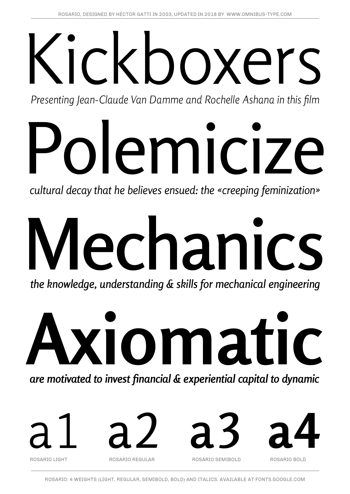
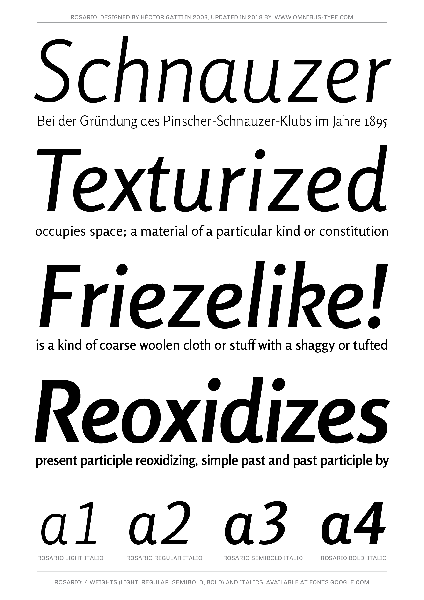

# Rosario

**Gatti, Omnibus-Type Team & Adobe Fonts**
*SIL Open Font License 1.1,*
*8 fonts, 844 glyphs each variant.*
*Letras Latinas 2004*

Rosario is a singular typeface with 4 weight variants, plus matching italics. Its grace lies in the classic proportions. Its weak endings make it subtle, yet dynamic. Named after a crowded city, it is suitable for diverse publishing contexts, such as popular magazines, poetry books, illustrated editions and academic journals. It was designed by Héctor Gatti initially for private use, later on developed by the Omnibus-Type Team, and optimized by Adobe Fonts.

#### Rosario contains:
* light / light italic
* regular / italic
* semibold / semibold italic
* bold / bold italic

To contribute to the project contact [Omnibus Type](http://omnibus-type.com/).

### Designer

* Héctor Gatti

## Building

Fonts are built automatically by GitHub Actions - take a look in the "Actions" tab for the latest build.

If you particularly want to build fonts manually on your own computer, you will need to install the [`yq` utility](https://github.com/mikefarah/yq). On OS X with Homebrew, type `brew install yq`; on Linux, try `snap install yq`; if all else fails, try the instructions on the linked page.

Then:

* `make build` will produce font files.
* `make test` will run [FontBakery](https://github.com/googlefonts/fontbakery)'s quality assurance tests.
* `make proof` will generate HTML proof files.

## License

Copyright (c) 2019, Omnibus-Type (www.omnibus-type.com | omnibus.type@gmail.com)

This Font Software is licensed under the SIL Open Font License, Version 1.1.
This license is copied below, and is also available with a FAQ at
http://scripts.sil.org/OFL

## Repository Layout

This font repository structure is inspired by [Unified Font Repository v0.3](https://github.com/unified-font-repository/Unified-Font-Repository), modified for the Google Fonts workflow.

======
## FONTLOG for the Rosario fonts

This file provides detailed information on the Rosario fonts software.  
This information should be distributed along with the Rosario fonts and any derivative works.

### Basic Font Information

Rosario is the name of the city of its type designer, 
Héctor Gatti. This is a new typeface of classic proportions, 
subtle contrast and soft endings. Carefully produced, 
elegant, ideal for magazines and academic journals.

### Rosario is a typeface family that supports Unicode language range: 

* Basic Latin 			U+0020-U+007E
* Latin-1 Supplement 		U+00A0-U+00FF

*To contribute to the project contact Omnibus-Type at omnibus.type@gmail.com*

**8 March (m4rc1e) 2019 Rosario v1.100**
- Variable font build chain added

**31 October (Omnibus-Type) 2018 Rosario v1.005**
- New weights: light, light italic, semibold and semibold italic
- Updated to GF Latin Plus set
- Supports 219 Latin languages used in 212 countries

**6 Jan 2016 (Dave Crossland) Rosario  v1.004**
- Bold Italic GSUB error fixed
- name table mac-encoded items removed
- Regular name ID4 fixed

**6 Feb 2015 (Omnibus-Type) Rosario  v1.001**
- New woff woff2 and eot formats
- No change to the outlines or the TTF Adobe TypeKit fonts

**15 May 2013 (Omnibus-Type) Rosario  v1.003**
- Adobe TypeKit updated all styles
- No change to outlines
- Improved hinting and other technical optimizations

**30 Aug 2011 (Héctor Gatti) Rosario  v1.002**
- Updated Regular
- Initial release of Italic style

**12 Jul 2011 (Héctor Gatti) Rosario  v1.001**
- Initial release under SIL Open Font License

### Acknowledgements

If you make modifications be sure to add your name (N), email (E), web-address
(if you have one) (W) and description (D). This list is in alphabetical order.

**N:** **Héctor Gatti**  
**E:** omnibus.type@gmail.com  
**W:** http://www.omnibus-type.com  
**D:** Designer  

**N:** **Tim Ahrens** *(with administrative assistance from Greg Veen)*  
**E:** gregveen@adobe.com  
**W:** http://www.typekit.com  
**D:** Font Engineer
